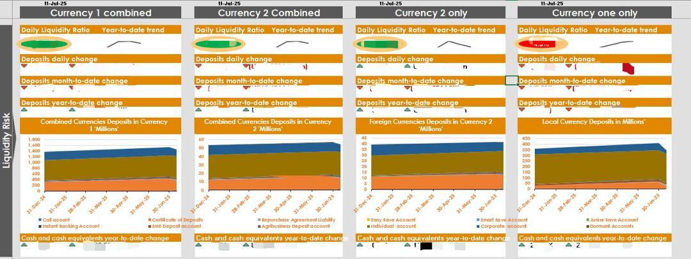

# middle-office-daily-kpi-dashboard
Middle Office Daily Liquidity and Deposit KPI Dashboard for performance and risk monitoring

# Middle Office Daily KPI Dashboard

## Project Overview
This project presents a Middle Office Daily KPI Dashboard designed to support liquidity risk monitoring and deposit performance analysis. The dashboard provides a consolidated daily view of key financial indicators across multiple currencies, enabling timely decision-making and operational oversight.

The dashboard was developed to support middle office functions by tracking liquidity ratios, deposit movements, and cash-equivalent trends on a daily basis.

---

## Key Metrics Tracked
- Daily Liquidity Ratio
- Year-to-Date Liquidity Trends
- Daily Deposit Changes
- Month-to-Date Deposit Changes
- Year-to-Date Deposit Growth
- Cash and Cash Equivalents Movement
- Deposit Composition by Account Type
- Currency-Specific and Combined Currency Views

---

## Dashboard Features
- Multi-currency analysis (Combined and individual currency views)
- Daily, Month-to-Date, and Year-to-Date performance tracking
- Visual indicators for trend direction and risk signals
- Time-series visualizations for deposit balances
- Designed for senior management and risk oversight reporting

---

## Tools and Technologies
- Microsoft Excel (Advanced formulas, charts, dashboards)
- Excel Macros and Automation
- Data Cleaning and Validation Techniques
- KPI Design and Financial Reporting Standards

---

## Dashboard Preview

---

## Business Value
- Enables early identification of liquidity risk
- Supports daily management decision-making
- Improves visibility into deposit trends and currency exposure
- Enhances operational reporting efficiency

---

## Simbarashe Dziike
**Simbarashe Dziike**  
Data Analyst | Banking, Risk & Performance Analytics
